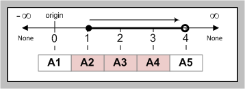
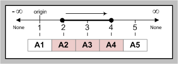

Welcome to Sliced
=================

The following material describes the first set of tools released into the kit ...

Slicing for users
-----------------

Python slices are beautiful -- `well at least for developers
<http://python-history.blogspot.com/2013/10/why-python-uses-0-based-indexing.html>`_;
but those `zero-based <http://en.wikipedia.org/wiki/Zero-based_numbering>`_, 
`right-open intervals <http://en.wikipedia.org/wiki/Interval_(mathematics)#Terminology>`_
could appear rather scary if they were to be exposed to your users in the wild.

.. sidebar:: New to slices?

    Check out the `informal introduction to Python
    <http://docs.python.org/2/tutorial/introduction.html#strings>`_,
    after that move on to `understanding indices and slicing
    <http://forums.udacity.com/questions/2017002/python-101-unit-1-understanding-indices-and-slicing>`_,
    and then visit the :doc:`visualizing Python slicing <python_slices>` section.

Unit-based, closed-intervals
^^^^^^^^^^^^^^^^^^^^^^^^^^^^
When exposing slicing to the general user population a unit-based,
closed-interval is typically a better choice -- for example look at the `Unix
cut <http://en.wikipedia.org/wiki/Cut_(Unix)>`_ command:

.. code-block:: bash

    $ echo A1 A2 A3 A4 A5|cut -d' ' -f2-4
    A2 A3 A4

.. sidebar:: Unit-Based, Closed-Interval

    The origin is now at one instead of zero, and the right end-point is closed
    instead of open.  Now when we cut items 2 to 4 from the sequence we get
    exactly that; the 2 :sup:`nd` to the 4 :sup:`th` item (inclusive).

Emulating cut
-------------

**sliced** supports emulation of cut's field grammar. **slicing_demo.py**
is included to help introduce you to sliced's basic functions:

.. code-block:: bash

    Enter dialect? unix_cut

    Select columns? 1, 3-5
    ['alpha-1', 'alpha-3', 'alpha-4', 'alpha-5']
    ['beta-1', 'beta-3', 'beta-4', 'beta-5']
    ['gamma-1', 'gamma-3', 'gamma-4', 'gamma-5']

    Select columns? 1,2,5-
    ['alpha-1', 'alpha-2', 'alpha-5', 'alpha-6']
    ['beta-1', 'beta-2', 'beta-5', 'beta-6']
    ['gamma-1', 'gamma-2', 'gamma-5', 'gamma-6']

    Select columns? 3
    ['alpha-3']
    ['beta-3']
    ['gamma-3']

Reporting bad grammar
^^^^^^^^^^^^^^^^^^^^^
If a user enters an invalid slice string (field arg) `sliced` has the ability
to show the user where the error occured.

.. code-block:: bash

    Select columns? -2, -2-5, 5-
    InvalidSliceString: -2, -2-5, 5-
                              ^
    Expected stringEnd at column 7.

Extending cut
-------------

Cut's field arg grammar is nice, but what if we want to support all the cool
features found in Python slicing?

.. sidebar:: Confused?

    See :doc:`Python slicing <python_slices>`.

Relative indices
^^^^^^^^^^^^^^^^
Support for specifying endpoints relative to the last position in the sequence.

Stepped intervals
^^^^^^^^^^^^^^^^^
Support for stepping through intervals at specified length (stride).

Reversed intervals
^^^^^^^^^^^^^^^^^^

Ability to change the direction of the interval.

New syntax
^^^^^^^^^^
- The range separator will need to be changed, since the dash character could
  cause ambiguity with the minus sign used to specify relative indices.
- An interval step size separator will need to be added.

To accomplish this let's use native Python slice syntax, but then extended it
with the following features found in cut:

.. sidebar:: Slice lists

    Included in Python's official grammar, but not implemented into the Python
    language. `sliced` supports them.

- Support for slice lists (zero or more slices separated by commas). 
- Unit-based, close-intervals instead of zero-based, right-open intervals.

Examples
^^^^^^^^

.. code-block:: bash

    Enter dialect? python_slice

    Select columns? -4:-2
    ['alpha-3', 'alpha-4', 'alpha-5']
    ['beta-3', 'beta-4', 'beta-5']
    ['gamma-3', 'gamma-4', 'gamma-5']

    Select columns? -2,-5
    ['alpha-5', 'alpha-2']
    ['beta-5', 'beta-2']
    ['gamma-5', 'gamma-2']

    Select columns? ::-1
    ['alpha-6', 'alpha-5', 'alpha-4', 'alpha-3', 'alpha-2', 'alpha-1']
    ['beta-6', 'beta-5', 'beta-4', 'beta-3', 'beta-2', 'beta-1']
    ['gamma-6', 'gamma-5', 'gamma-4', 'gamma-3', 'gamma-2', 'gamma-1']

    Select columns? 2::2
    ['alpha-2', 'alpha-4', 'alpha-6']
    ['beta-2', 'beta-4', 'beta-6']
    ['gamma-2', 'gamma-4', 'gamma-6']

Support for intervals
---------------------

`sliced` also supports grammars that allow the interval type to be specified.
For example Ruby range syntax uses a range separator of '...' to indicate a
closed interval (include both endpoints) or '....' to indicate a right-open
interval (don't include stop endpoint).

Dot notation, extends the Python slice grammar to allow open, left-open,
right-open or closed intervals to be specified.  To learn more visit the
:doc:`grammar` section of this document.

Additional features
-------------------

This page is intended only as a high-level introduction to `sliced`, additional
features are described elsewhere.

.. toctree::
   :maxdepth: 2
   :hidden:

   index
   examples
   howto
   python_slices
   endpoints
   intervals
   grammar
   guiding_principles
