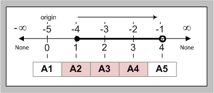
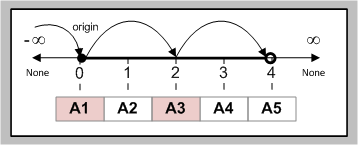
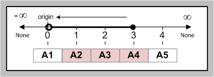

Visualizing slices
==================

`This section provides diagrams to help visualize how Python slices work.`

Python slices are `right-open intervals
<http://en.wikipedia.org/wiki/Interval_(mathematics)#Terminology>`_ consisting
of `zero-based <http://en.wikipedia.org/wiki/Zero-based_numbering>`_ endpoints:

.. code-block:: python

    In [1]: ['A1', 'A2', 'A3', 'A4', 'A5'][1:4]
    Out[1]: ['A2', 'A3', 'A4']

.. sidebar:: New to slices?

    Check out the `informal introduction to Python
    <http://docs.python.org/2/tutorial/introduction.html#strings>`_ and 
    `understanding indices and slicing
    <http://forums.udacity.com/questions/2017002/python-101-unit-1-understanding-indices-and-slicing>`_.

.. image:: _static/figure1.png

Relative indices
----------------

.. code-block:: python

    In [2]: ['A1', 'A2', 'A3', 'A4', 'A5'][-4:-1]
    Out[2]: ['A2', 'A3', 'A4']

.. sidebar:: Relative Endpoint

    Negative indices start counting from the right, where :code:`-1` is the
    right-most position; regardless of whether the endpoint is unit-based or
    zero-based.

Stepped intervals
-----------------

.. code-block:: python

    In [3]: ['A1', 'A2', 'A3', 'A4', 'A5'][:4:2]
    Out[3]: ['A1', 'A3']

.. sidebar:: Stepped Interval

    This particular interval is left unbounded, where :code:`[:4:2]`
    is equivalent to :code:`[None:4:2]`. The **None** equates to
    *inifinity* on the number line.

The terms **step** and **stride** are sometimes used interchangeably.  When an
interval's stride is either not specified or set to **None** the
step-size will be default to 1.

Reversed intervals
------------------

Reversed strides are occassionally a point of confusion for people just
starting out with Python because the open end is flipped.

.. code-block:: python

    In [4]: ['A1', 'A2', 'A3', 'A4', 'A5'][3:0:-1]
    Out[4]: ['A4', 'A3', 'A2']

.. sidebar:: Reversed Stride

    It's still right-open, but because the direction is reversed (see the
    arrow), the open end of the interval line is also flipped.

Extended slices
---------------
Another good place to read up on slicing is this
`extended slices <https://docs.python.org/2.3/whatsnew/section-slices.html>`_
page on the official Python website.  It's written for Python 2.3, but the
information is still relevant in current versions of Python. If you want to
work through the examples in Python 3.x then convert the range bjects into
lists. For example where it shows :code:`range(10)` replace the code with
:code:`list(range(10))`.
